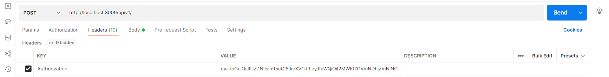
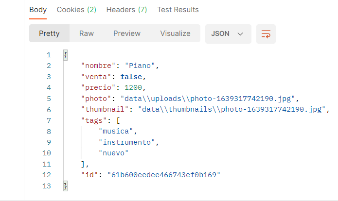

# PRÁCTICA INTRODUCCIÓN A NODE.JS
---

## Enunciado

- Desarrollar una API que se ejecutará en el servidor de un servicio de venta de artículos de segunda mano llamado ***Nodepop***.

- El servicio mantiene anuncios de compra o venta de artículos y permite buscar como poner filtros por varios criterios, por tanto la API deberá proveer los métodos necesarios para esto

## Iniciar el proyecto
---

- Clonamos el repositorio:

  - ***HTTPS*** => `git clone https://github.com/proyectojotazo/nodepop.git`
  - ***SSH*** => `git clone git@github.com:proyectojotazo/nodepop.git`

- Una vez clonado, instalaremos las dependencias con `npm install` o `npm i`

- Abrimos el archivo `.env.default` y añadiremos las variables de entorno:

  - PORT = `<puerto a usar>`
  - MONGODB_URI = `<mongodb_URI>`
  - JWT_SECRET = `<your secret>`
  - USER_SESSION_SECRET = `<your secret>`

  > Una vez hayamos rellenado los campos correspondientes, renombraremos el archivo `.env.default` a `.env`. 

- En caso de no rellenar las variables de entorno, por defecto la aplicación usará el puerto `3000` y nos generará una base de datos llamada `anuncios`

- Una vez tengamos todo lo anterior realizado, podremos realizar los siguientes ***Scripts***

  > Se recomienda, una vez completados los anteriores puntos, arrancar con el script ***npm run installDB*** antes de iniciar la aplicación, para el correcto funcionamiento de la misma

## ***SCRIPTS***
---

  - `npm start`: 

    - Se ejecutará el archivo `bin/www`. Abrimos el navegador e introducimos `localhost:<numPORT>` o `127.0.0.1:<numPORT>` y nos aparecerá la página principal de ***NodePop***. Si hemos completado el archivo `.env` pondremos el puerto usado en él. Si no, el puerto por defecto es el `3000`
  
  - `npm run dev`:

    - Similar a `npm start` usado para desarrollo usando `nodemon`

  - `npm run installDB`:

    - Script que nos inicializará la base de datos introduciendo 2 anuncios por defecto en nuestra base de datos

  - `npm run pm2:start`:

    - Script que nos iniciará, tanto la aplicación como el microservicio con pm2
  
  - `npm run pm2:stop`:

    - Script que detendrá, tanto la aplicación como el microservicio con pm2
  
  - `npm run pm2:delete`:

    - Script que nos borrará, tanto la aplicación como el microservicio de pm2
  
  - `npm run pm2:reload`:

    - Script que nos recargará, tanto la aplicación como el microservicio con pm2


## ***RUTAS FRONT***
---

- Tipo: **GET** `localhost:PORT`:

  - Nos mostrará la página inicial del proyecto con los artículos incluidos por defecto habiendo ejecutado el script `npm run installDB`

- Tipo: **GET** `localhost:PORT/sign-in`:

  - Nos mostrará la página del formulario para crear un nuevo usuario en nuestra base de datos

- Tipo: **POST** `localhost:PORT/sign-in`:

  - Nos realizará la creación del usuario en nuestra base de datos

- Tipo: **GET** `localhost:PORT/login`:

  - Nos mostrará la página del formulario para iniciar sesión con un usuario que tengamos en nuestra base de datos

- Tipo: **POST** `localhost:PORT/login`:

  - Nos realizará el inicio de sesión con el usuario

- Tipo: **GET** `localhost:PORT/logout`:

  - Nos cerrará la sesión del usuario

## ***RUTAS API***
---

- Tipo: **POST** `localhost:PORT/apiv1/authenticate`

  - Realizando esta petición con un body: 
  ```
  {
    email: emailUsuario,
    password: passwordUsuario
  }
  ```
  Nos devolverá un token ***JWT*** con el cual nos podremos identificar en las rutas que lo requieran

- Tipo: **GET** `localhost:PORT/apiv1` ***(PRIVADA POR JWT)***:

  - Nos redireccionará a `localhost:PORT/apiv1/anuncios` 
  - Deberemos pasarle, por cabeceras (o Headers) un parámetro llamado `Authorization` con el JWToken, o, por URL tal que:
  `http://localhost:PORT/apiv1?token=JWTOKEN` o incluso en el body de la petición para que nos devuelva el listado de anuncios en `JSON`
  - En el momento de la redirección ya nos pasará tambien el **JWT**
  
- Tipo: **POST** `localhost:PORT/apiv1` ***(PRIVADA POR JWT)***:

  - Será la ruta sobre la que haremos la creación de anuncios con ***POSTMAN*** o cualquier otra aplicación para peticiones http

- Tipo: **GET** `localhost:PORT/apiv1/anuncios`:

  - Deberemos pasarle, por cabeceras (o Headers) un parámetro llamado `Authorization` con el JWToken, o, por URL tal que:
  `http://localhost:PORT/apiv1/anuncios?token=JWTOKEN` o incluso en el body de la petición para que nos devuelva el listado de anuncios en `JSON`

## ***RUTAS FILTRADAS***
---

- ***RUTA VISTA ANUNCIOS***: `localhost:PORT/?parametro1=valor&parametro2=valor`

- ***RUTA VISTA API***: `localhost:PORT/apiv1/anuncios/?parametro1=valor&parametro2=valor`

> Recordar que es una ruta protegida por JWToken

- Parametros de filtrado permitidos:

  - Nombre: ***STRING*** 
  - Venta: ***BOOLEAN***
  - Precio: ***NUMBER***
  - Tags: ***STRING***
  - Start: ***NUMBER***
  - Limit: ***NUMBER***
  - Sort: ***STRING***

  ### Detalles a tener en cuenta:
  ---

    - ***Venta***: solo podrá tener el valor de ***TRUE*** o ***FALSE***, en caso de que se le pase otro valor, no se tendrá en cuenta a la hora del filtrado

    - ***Precio***: el valor de precio puede ser cualquiera de los siguientes:

    ```
    precio=120 ==> Nos buscará todos los articulos que tengan EXACTAMENTE este precio

    precio=120- ==> Nos buscará todos los articulos que tengan un precio mínimo de 120

    precio=120-890 ==> Nos buscará todos los articulos que tengan un precio mínimo de 120 hasta un máximo de 890

    precio=-890 ==> Nos buscará todos los articulos que tengan un precio máximo de 890
    ```

    - ***Start***: Define el numero de anuncios a 'saltarse' de nuestra lista

      - Ejemplo: 

        - `http://localhost:PORT/?precio=100-2500&start=2`

        > Si por precio, nos encontrara 10 anuncios que coinciden en ese rango, los 2 primeros anuncios serian omitidos

    - ***Limit***: Define la cantidad máxima de anuncios a mostrar de nuestra lista

      - Ejemplo: 

        - `http://localhost:PORT/?precio=100-2500&limit=5`

        > Si por precio, nos encontrara 10 anuncios que coinciden en ese rango, nos mostraría los 5 primeros anuncios

    - ***Sort***: Solo tiene 2 valores posibles `nombre` y `precio`.
    Con `sort=nombre` se ordenaría nuestra lista de anuncios a mostrar por nombre y con `sort=precio` por precio, de menor a mayor

  
## ***CREAR NUEVOS ARTICULOS***
---

- Para realizar peticiones **POST** y crear nuevos articulos hay 2 opciones:

  - ***POSTMAN***

    - Deberemos crearnos una cuenta en [POSTMAN](https://www.postman.com)
    - Deberemos pasar los parametros como se indica en la siguiente imagen:

    ***Token***
    
      
    ---
    
    - Cada ***KEY*** será el párametro y el ***VALUE*** el valor que le queramos asignar a cada una

      > Recuerda que ***venta*** será un parámetro booleano que solo aceptará ***true*** o ***false*** en función de si el anuncio es para vender o que se está buscando ese artículo

    ***Body***

      

    - Si todo está correcto, recibiremos la respuesta con un JSON con el anuncio creado

    ***Response***

      