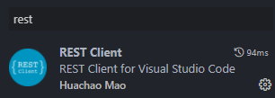
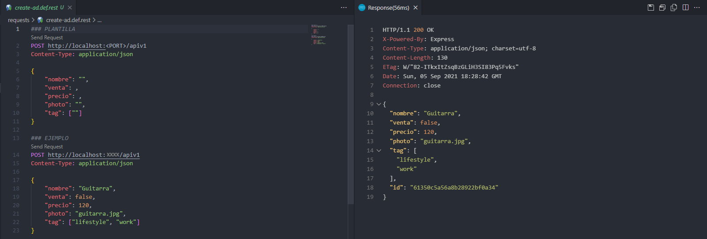

# PRÁCTICA INTRODUCCIÓN A NODE.JS
---

## Enunciado

- Desarrollar una API que se ejecutará en el servidor de un servicio de venta de artículos de segunda mano llamado ***Nodepop***.

- El servicio mantiene anuncios de compra o venta de artículos y permite buscar como poner filtros por varios criterios, por tanto la API deberá proveer los métodos necesarios para esto

## Iniciar el proyecto
---

- Clonamos el repositorio:

  - ***HTTPS*** => `git clone https://github.com/proyectojotazo/nodepop.git`
  - ***SSH*** => `git clone git@github.com:proyectojotazo/nodepop.git`

- Una vez clonado, instalaremos las dependencias con `npm install` o `npm i`

- Abrimos el archivo `.env.default` y añadiremos las variables de entorno:

  - PORT = `<puerto a usar>`
  - MONGODB_URI = `<mongodb_URI>`

  > Una vez hayamos rellenado los campos correspondientes, renombraremos el archivo `.env.default` a `.env`

- Una vez tengamos todo lo anterior realizado, podremos realizar los siguientes ***Scripts***

  > ***IMPORTANTE!*** Si es la primera vez que ejecutamos el proyecto iniciar la base de datos con el *script* `npm run installDB`. Mas detalles en ***SCRIPTS***

## ***SCRIPTS***
---

  - `npm start`: 

    - Se ejecutará el archivo `bin/www`. Abrimos el navegador e introducimos `localhost:<numPORT>` o `127.0.0.1:<numPORT>` y nos aparecerá la página principal de ***NodePop***
  
  - `npm run dev`:

    - Similar a `npm start` usado para desarrollo usando `nodemon`

  - `npm run installDB`:

    - Script que nos inicializará la base de datos introduciendo 2 anuncios por defecto en nuestra base de datos

## ***RUTAS***
---

- `localhost:PORT`:

  - Nos mostrará la página inicial del proyecto con los artículos incluidos por defecto habiendo ejecutado el script `npm run installDB`

- `localhost:PORT/apiv1`:

  - Nos mostrará el listado de artículos en formato `JSON`

- `localhost:PORT/images/<nombreimagen>`

  - Nos mostrará la imagen que tengamos en la carpeta `/images`.

  - Deberemos de tener la imagen en la ruta `public/images` y el `<nombreimagen>` deberá ser el nombre del archivo y su extension. Ej: `public/images/bike.jpg` la ruta quedaría así: `localhost:PORT/images/bike.jpg`

  > Por defecto tenemos 2 imagenes, bike.jpg y iphone11.jpg. Si quieres añadir más imagenes, debes introducirlas en `public/images`

## ***RUTAS FILTRADAS***
---

- ***RUTA VISTA ANUNCIOS***: `localhost:PORT/?parametro1=valor&parametro2=valor`

- ***RUTA VISTA API***: `localhost:PORT/apiv1/anuncios/?parametro1=valor&parametro2=valor`

- Parametros de filtrado permitidos:

  - Nombre: ***STRING*** 
  - Venta: ***BOOLEAN***
  - Precio: ***NUMBER***
  - Tags: ***STRING***
  - Start: ***NUMBER***
  - Limit: ***NUMBER***
  - Sort: ***STRING***

  ### Detalles a tener en cuenta:
  ---

    - ***Venta***: solo podrá tener el valor de ***TRUE*** o ***FALSE***, en caso de que se le pase otro valor, no se tendrá en cuenta a la hora del filtrado

    - ***Precio***: el valor de precio puede ser cualquiera de los siguientes:

    ```
    precio=120 ==> Nos buscará todos los articulos que tengan EXACTAMENTE este precio

    precio=120- ==> Nos buscará todos los articulos que tengan un precio mínimo de 120

    precio=120-890 ==> Nos buscará todos los articulos que tengan un precio mínimo de 120 hasta un máximo de 890

    precio=-890 ==> Nos buscará todos los articulos que tengan un precio máximo de 890
    ```

    - ***Start***: Define el numero de anuncios a 'saltarse' de nuestra lista

      - Ejemplo: 

        - `http://localhost:PORT/?precio=100-2500&start=2`

        > Si por precio, nos encontrara 10 anuncios que coinciden en ese rango, los 2 primeros anuncios serian omitidos

    - ***Limit***: Define la cantidad máxima de anuncios a mostrar de nuestra lista

      - Ejemplo: 

        - `http://localhost:PORT/?precio=100-2500&limit=5`

        > Si por precio, nos encontrara 10 anuncios que coinciden en ese rango, nos mostraría los 5 primeros anuncios

    - ***Sort***: Actualmente solo tiene 2 valores posibles `nombre` y `precio`.
    Con `sort=nombre` se ordenaría nuestra lista de anuncios a mostrar por nombre y con `sort=precio` por precio, de menor a mayor

  
  
## ***CREAR NUEVOS ARTICULOS***
---

- Para realizar peticiones **POST** y crear nuevos articulos hay 2 opciones:

  - ***POSTMAN***

    - Deberemos crearnos una cuenta en [POSTMAN](https://www.postman.com)
    - Deberemos pasar los parametros como se indica en la siguiente imagen:

      

    - La url donde hacer la petición ***POST*** será `http://localhost:XXXX/apiv1` donde `XXXX` será el puerto que tengamos asignado.

    - Clickaremos en la pestaña ***BODY*** y seleccionaremos el tipo de codificación `x-www-form-urlencoded`

    - Cada ***KEY*** será el párametro y el ***VALUE*** el valor que le queramos asignar a cada una

      > Recuerda que ***venta*** será un parámetro booleano que solo aceptará ***true*** o ***false*** en función de si el anuncio es para vender o que se está buscando ese artículo

    - ***IMPORTANTE*** Para añadir más de un *tag* hemos de pasarle tantas ***KEY*** y ***VALUE*** como tags queramos, como en la imagen

    - Si todo está correcto, recibiremos la respuesta con un JSON con el anuncio creado

  - **Visual Studio Code Extension:** ***REST Client***

    - Debemos instalar la extensión ***REST Client***
    
    

    - Una vez instalada vamos a la carpeta `requests` y renombramos el archivo `create-ad.def.rest` a `create-ad.rest` y lo abrimos.     

    

    - El archivo tendrá los datos de la izquierda en un principio.

    - Simplemente debemos de cambiar el `<PORT>` por el que tengamos asignado y rellenar los campos tal y como se indica en el ejemplo.

    - Una vez tengamos todo rellenado deberemos clickar donde aparece el mensaje `Send Request`.

    - Si todo está correcto, nos aparecerá la respuesta en el lateral, tal y como se ve a la derecha de la imagen