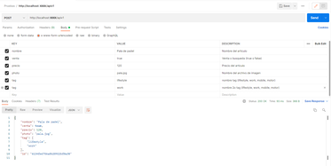

# PRÁCTICA INTRODUCCIÓN A NODE.JS
---

## Enunciado

- Desarrollar una API que se ejecutará en el servidor de un servicio de venta de artículos de segunda mano llamado ***Nodepop***.

- El servicio mantiene anuncios de compra o venta de artículos y permite buscar como poner filtros por varios criterios, por tanto la API deberá proveer los métodos necesarios para esto

## Iniciar el proyecto
---

- Clonamos el repositorio:

  - ***HTTPS*** => `git clone https://github.com/proyectojotazo/nodepop.git`
  - ***SSH*** => `git clone git@github.com:proyectojotazo/nodepop.git`

- Una vez clonado, instalaremos las dependencias con `npm install` o `npm i`

- Abrimos el archivo `.env.default` y añadiremos las variables de entorno:

  - PORT = `<puerto a usar>`
  - MONGODB_URI = `<mongodb_URI>`

  > Una vez hayamos rellenado los campos correspondientes, renombraremos el archivo `.env.default` a `.env`

- Una vez tengamos todo lo anterior realizado, podremos realizar los siguientes ***Scripts***

  > ***IMPORTANTE!*** Si es la primera vez que ejecutamos el proyecto iniciar la base de datos con el *script* `npm installDB`. Mas detalles en ***SCRIPTS***

### ***SCRIPTS***
---

  - `npm start`: 

    - Se ejecutará el archivo `bin/www`. Abrimos el navegador e introducimos `localhost:<numPORT>` o `127.0.0.1:<numPORT>` y nos aparecerá la página principal de ***NodePop***
  
  - `npm run dev`:

    - Similar a `npm start` usado para desarrollo usando `nodemon`

  - `npm run installDB`:

    - Script que nos inicializará la base de datos introduciendo 2 anuncios por defecto en nuestra base de datos

### ***RUTAS***
---

- `localhost:PORT`:

  - Nos mostrará la página inicial del proyecto con los artículos incluidos por defecto habiendo ejecutado el script `npm run installDB`

- `localhost:PORT/apiv1`:

  - Nos mostrará el listado de artículos en formato `JSON`

- `localhost:PORT/images/<nombreimagen>`

  - Nos mostrará la imagen que tengamos en la carpeta `/images`.

  - Deberemos de tener la imagen en la ruta `public/images` y el `<nombreimagen>` deberá ser el nombre del archivo y su extension. Ej: `public/images/bike.jpg` la ruta quedaría así: `localhost:PORT/images/bike.jpg`

### ***CREAR NUEVOS ARTICULOS***
---

- Para realizar peticiones **POST** y crear nuevos articulos hay 2 opciones:

  - ***POSTMAN***

    - Deberemos crearnos una cuenta en [POSTMAN](https://www.postman.com)
    - Deberemos pasar los parametros como se indica en la siguiente imagen:
    

### ***TRABAJANDO EN ELLO***
---

- Filtrado de articulos por parametros como, nombre, precio..., tanto en la vista como en la API

- Estilizar con **CSS**  

- Crear pagina de error personalizada

